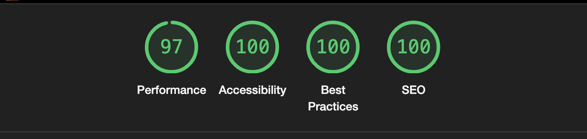

## Dev.to Frontend Challenge August

This project it will be used for the dev.to frontend challenge. I choose the second challenge: Cricket League!.

## How it works?

I'm using the only Vanilla Javascript and CSS.

I'm not using NPM/Yarn/PNPM as dependency package manager. This project is a simple project using vanilla javascript and using all the functions to replace and manipulate the DOM, just using javascript.

All styles is a simple file of CSS.

Also, is responsive, with accessibility, performance and Best SEO!å

## How to run?

Just use the Live Server of VS Code extension. Click on HTML file with the right button of the mouse and click on `Open Live Server`. Access the `http://localhost:5501/index.html`.

This project is hosted on Vercel. Just access the `https://frontend-challenge-devto-recreation-edition.vercel.app/`

## Light House Metrics

